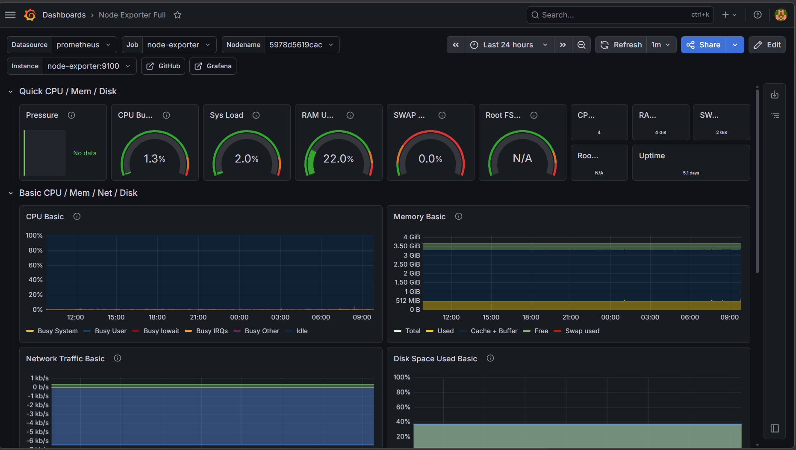
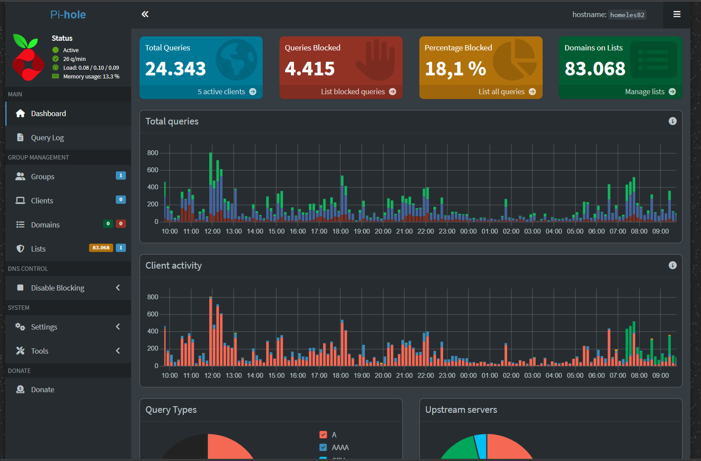

[README.md](https://github.com/user-attachments/files/28268315/README.md)
# 🏠 Mohammad's Homelab

<div align="center">


> 🎓 FISI-Azubi @ GFN GmbH Hamburg | Raspberry Pi 400 Homelab für IT-Security & Netzwerk-Praxis

</div>

---

## 🟢 Service Status

| Service | Status | URL | Port |
|---------|--------|-----|------|
| 🔴 Pi-hole DNS |  | `192.168.2.186/admin` | `53 / 80` |
| 📊 Grafana |  | `192.168.2.186:3000` | `3000` |
| 🔥 Prometheus |  | `192.168.2.186:9090` | `9090` |
| 📈 Node Exporter |  | `192.168.2.186:9100` | `9100` |
| 🔒 SSH |  | `192.168.2.186` | `22` |

---

## 🖥️ Hardware

```
┌─────────────────────────────────────────┐
│         Raspberry Pi 400                │
│  CPU:  ARM Cortex-A72 (4 Kerne)        │
│  RAM:  4 GB LPDDR4                     │
│  OS:   Raspberry Pi OS 64-bit          │
│  IP:   192.168.2.186 (statisch)        │
│  SD:   16 GB MicroSD                   │
└─────────────────────────────────────────┘
```

---

## 🌐 Netzwerk-Architektur

```
Internet
    │
    ▼
┌─────────────────┐
│  Speedport       │  192.168.2.1
│  Smart 4 Router  │  Ports: 53, 80, 8443, 5060
└────────┬────────┘
         │
    ─────┴──────────────────────────────
    │              │              │
    ▼              ▼              ▼
┌────────┐   ┌──────────┐   ┌──────────┐
│ Laptop │   │  Pi 400  │   │ Kali VM  │
│ .185   │   │  .186    │   │  .187    │
└────────┘   └────┬─────┘   └──────────┘
                  │
         ┌────────┴────────┐
         │    Docker        │
         │  ┌────────────┐ │
         │  │  Pi-hole   │ │ :53/:80
         │  ├────────────┤ │
         │  │  Grafana   │ │ :3000
         │  ├────────────┤ │
         │  │ Prometheus │ │ :9090
         │  ├────────────┤ │
         │  │Node Export │ │ :9100
         │  └────────────┘ │
         └─────────────────┘
```

---

## 📊 Monitoring Dashboard

> Grafana + Prometheus + Node Exporter — Live System Monitoring



### Live Metriken (Stand: Mai 2026)
| Metrik | Wert |
|--------|------|
| CPU | ~1.3% |
| RAM | ~22% |
| Uptime | 5.1 Tage |
| SWAP | 0% |

---

## 🔴 Pi-hole DNS Dashboard

> Blockiert Werbung & Tracking für das gesamte Heimnetzwerk



### DNS Statistiken (Stand: Mai 2026)
| Metrik | Wert |
|--------|------|
| Total Queries | 24.343 |
| Blockierte Queries | 4.415 |
| Blockierungsrate | 18,1% |
| Domains auf Blockliste | 83.068 |
| Aktive Clients | 5 |

---

## 🐉 IT-Security Lab

> Kali Linux VM für Ethical Hacking & Penetration Testing

```bash
# Netzwerk-Scan vom eigenen Netzwerk
nmap -sn 192.168.2.0/24
# → 16 Geräte gefunden

# Service-Scan auf Raspberry Pi
nmap -sV 192.168.2.186
# → SSH, DNS, HTTP, Grafana, Prometheus gefunden

# Webserver-Analyse
nikto -h http://192.168.2.186
# → 8.332 Requests in 749 Sekunden

# Verzeichnis-Scan
dirb http://192.168.2.186
# → /admin gefunden (Pi-hole Dashboard)
```

---

## 🐧 Linux-Kenntnisse

```bash
# Dateisystem
pwd | ls -la | cd | mkdir | cat | echo | cp | mv | rm

# System
df -h | free -h | systemctl status/start/stop/restart

# Berechtigungen
chmod 600/644/755/777 | chown user:group

# Prozesse
ps aux | top | kill PID | kill -9 PID

# Netzwerk
ip a | ping -c 4 | ss -tulnp

# Suchen
grep "text" datei | find ~ -name "*.yml" | ps aux | grep docker
```

---

## 📁 Repository Struktur

```
homelab/
├── README.md
├── linux-grundlagen.md
├── monitoring/
│   ├── docker-compose.yml    # Grafana + Prometheus + Node-Exporter
│   └── prometheus.yml        # Prometheus Konfiguration
└── screenshots/
    ├── grafana-dashboard.png
    └── pihole-dashboard.png
```

---

## 🚀 Quick Start

### Pi-hole installieren
```bash
curl -sSL https://install.pi-hole.net | bash
```

### Monitoring Stack starten
```bash
cd ~/monitoring
docker compose up -d
docker ps
```

### SSH Verbindung
```bash
ssh homeles82@192.168.2.186
```

---

## 📅 Projekt-Timeline

| Datum | Meilenstein |
|-------|-------------|
| Mai 2026 | 🎉 Homelab gestartet |
| Mai 2026 | ✅ Nmap Netzwerk-Scanning |
| Mai 2026 | ✅ Raspberry Pi 400 eingerichtet |
| Mai 2026 | ✅ Pi-hole DNS installiert |
| Mai 2026 | ✅ Docker + Grafana + Prometheus |
| Mai 2026 | ✅ GitHub Repository erstellt |
| Mai 2026 | ✅ Linux-Grundlagen gelernt |
| Mai 2026 | ✅ Kali Linux VM installiert |
| Mai 2026 | ✅ Erstes Penetration Testing |
| Geplant | 🔜 Cloudflare Tunnel |
| Geplant | 🔜 Uptime Kuma |
| Geplant | 🔜 VPN Server |

---

## 👨‍💻 Über mich

```
Name:       Mohammad
Ausbildung: FISI (Fachinformatiker Systemintegration)
Betrieb:    GFN GmbH Hamburg
Fokus:      IT-Security, Netzwerk, Linux, DevOps
GitHub:     github.com/momo1072
```

---

<div align="center">

⭐ **Star this repo if you like it!** ⭐


</div>
